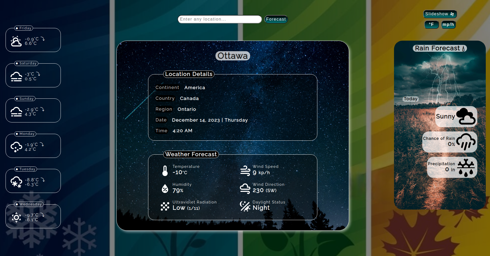

<div align='center'>

# Weather Forecast
</div>
<div align='center'>
    <h3>💻 Languages</h3>
    
    
    
    <h3>🔧 Technologies</h3>
    
    
    
    
    
    
    
    
    
    <h4><a href="https://asdacosta.github.io/weather-forecast/">Live Preview</a></h4>
</div>

**Demo:**

<!--  -->

<details>

**<summary>Screen views</summary>**

**Desktop View:**

<!--  -->
<br>

**Mobile View:**

<!--  -->


</details>

## 🌐 Origin
[The Odin Project](https://www.theodinproject.com/)

## 📝 Description
Builds a weather forecast website using APIs.

<details>
<summary>Features</summary>

* Display a 7-day weather forecast for any location.
* Set background based on location's Time and Temperature.
* Display location's root (Continent, Country, Region).
* Display Date and Time of location at time of forecast.
* Toggle Temperature unit (Fahrenheit/Celsius) and Wind Speed unit (KPH/MPH).
* Display a slideshow of the next 6-day weather forecast.
* View detailed weather by hovering over the 6-day forecast.
* Displays forecast details in readable format.
* Smooth loading animation during search.

</details>

## 🎯 Relevance
To solidify concepts of `Promise, Async/Await and Using APIs` in JavaScript. 

## 👥 Intended Audience
Developers, users, recruiters.

> [!NOTE]
> Users can install all dependencies using `package.json` file via:
> ```bash
> npm install
> ```

## 📂 Files
<details>
<summary>Invert</summary>

| File | Description |
| - | - |
|`src/*`| Source files that are bundled into the output directory `dist/`.|
|`src/index.js`| The main JavaScript entry point that bundling begins.|
|`dist/*`| Output files from bundling of files in directory `src/`.|
|`dist/main.js`| Main JavaScript output file that contains the bundled JavaScript code. Code is minified and optimized for deployment (Due to mode set to production in webpack config). |
|`package*`| Contains details of project and dependencies versions.|
| `algorithm.txt` | Algorithm for `JavaScript`. |
|`readme-assets/*`| Live demo and different screen views used in `README.md`.|

</details>

## ©️ Credit
<details>
<summary>Invert</summary>

| File | Description |
| - | - |
|`src/assets/morning.jpg`| Photo created by Jonatan Pie on [Unsplash](https://unsplash.com/).|
|`src/assets/evening.jpg`| Photo created by Andre Benz on [Unsplash](https://unsplash.com/).|
|`src/assets/rain.jpg`| Photo created by Jonathan Bowers on [Unsplash](https://unsplash.com/).|
|`src/assets/night.jpg`| Photo created by Pexels on [Pixabay](https://pixabay.com/).|
|`src/assets/midnight.jpg`| Photo created by Neale LaSalle on [Pexels](https://www.pexels.com/).|
|`src/assets/storm.png`| Photo created by Freepik on [Flaticon](https://www.flaticon.com/).|


</details>

## 🔄 Improvements
<details>
<summary>Invert</summary>

- [ ] Add hourly weather forecast for current day. (Check other works for inspo)
- [ ] Use better background images in .main-sec that depict current weather accurately (Set image for each condition.text in object).
- [ ] Create mobile version. (Remember to work on this functionality in a separate branch).

</details>

## 👤 Curator
1. [Abraham Da Costa Silvanus](https://github.com/asdacosta) 

<br>

> [!IMPORTANT]
> Seek contributor's consent for any code usage.

**[🞁 Top](#weather-forecast)**